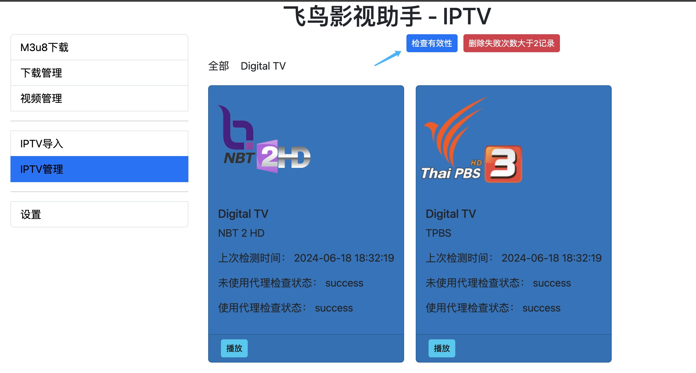

# flybird-m3u8downloader
flybird-m3u8downloader 是一款有用户界面（GUI）的多用途 m3u8 工具。  
flybird-m3u8downloader 功能围绕m3u8的三个应用场景开发： 点播、 直播、 IPTV。  

## 功能列表
 1. m3u8 视频下载
    - 下载 m3u8 点播
    - 下载 m3u8 直播 
    - 查看m3u8原文件内容
    - 视频解密
    - 设置自定义 header头
    - 通过代理下载视频

 2. 播放代理
    -  使用代理 在线播放 CORS m3u8 资源 (在线m3u8播放器多数不能播放 CORS 受限资源。)

 3. 视频管理
    - 播放已下载 m3u8 视频
    - m3u8 导出 MP4
    - 查看Variant分辨率、删除 Variant
    - 播放 TS 片段或者单个 TS。
    - 删除 TS （如：下载的视频中包含广告）
    - 等

 4. IPTV
    - 导入 IPTV
    - 展示和播放 IPTV
    - 编辑 TV
    - 批量检测 TV 是否有效
    - 批量删除 错误次数 >= 2的 TV

 5. 设置代理服务器
    - 借用代理线路 访问受限资源

### 开发者选项
   - 查看 m3u8内容
   - 下载 m3u8 全分辨率视频
   - 检查m3u8是否支持跨域播放

### 亮点功能 重点说明
代理播放 和 IPTV 有效性检测是本工具不可忽视的两个功能点。  
代理播放：解决m3u8 CORS访问受限问题。
IPTV 有效性检测： 直接 + 代理双路检测，直观展示m3u8资源是否有效。

## 系统支持
 - Windows 
 - MacOS

# m3u8播放器比较

|     |      普通m3u8在线播放器      |  Flybird 播放器 |
|----------|:-------------:|------:|
| 公开资源 |   支持 | 支持 |
| CORS受限资源 |    X   |   支持 |
| 需代理访问资源 | X |    支持 |

网上很多m3u8视频非真实失效， 有很大一部分是CORS受限不可访问， Flybird 播放器可播放所有有效的m3u8视频。 

## 软件下载地址
> https://github.com/youwen21/flybird-m3u8downloader/releases

## 软件截图展示
飞鸟M3u8视频下载器
 

M3u8下载预览
  

M3u8管理
  

本地播放M3u8
 

Master Playlist Edit
 

Play Segment
 

IPTV import
 
 

IPTV list
 

IPTV show
 

IPTV valid check
 

## Star History

## QQ交流群
QQ交流群： 854313352  

  

<a href="https://qm.qq.com/q/3pz7V9BHJu">点击链接加入群聊【就是玩群】：https://qm.qq.com/q/3pz7V9BHJu</a>

# HLS 官方说明文档
> https://developer.apple.com/streaming/