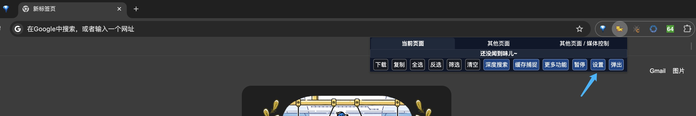
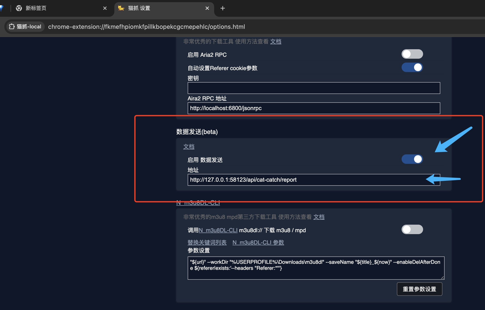

# 数据接收

## 下载《猫抓》浏览器插件

猫抓 浏览器插件 支持 Chrome,  Edge, Firefox 浏览器

猫抓文档地址

github 仓库和文档
https://github.com/xifangczy/cat-catch

用户文档
https://o2bmm.gitbook.io/cat-catch/

## 设置《猫抓》

打开猫抓设置页面， 找到 “数据发送”  

启用数据发送，  配置发送地址为： http://127.0.0.1:58123/api/cat-catch/report  

局域网内可接收来自其他机器的数据上报： http://局域网IP地址:58123/api/cat-catch/report  

打开猫抓设置页面
    

启用数据发送，配置数据发送地址
    

## 接收到的数据效果预览

数据接收
  

