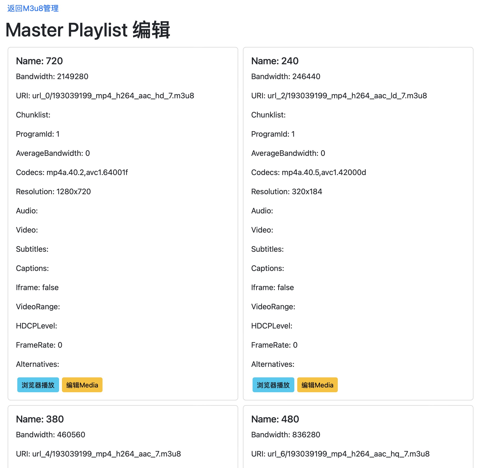

# m3u8视频下载

## 功能列表
 1. m3u8 视频下载
    - 查看m3u8文件内容
    - 选择视频分辨率
    - m3u8 点播下载 
    - m3u8 直播下载  
    - 视频解密
    - 自定义 header头
    - 通过代理下载视频

 2. 播放 m3u8 和 mpd 视频
    -  在线播放  m3u8 视频
    -  使用代理播放 CORS受限 m3u8 视频
    -  在线播放 mpd 视频

 3. 视频管理
    - 播放已下载 m3u8 视频
    - m3u8 导出 MP4
    - 查看Variant分辨率、删除 Variant
    - 播放 TS 片段或者单个 TS。
    - 删除 TS （如：下载的视频中包含广告）
    - 等

### 开发者选项
   - 查看 m3u8内容
   - 下载 m3u8 全分辨率视频
   - 检查m3u8是否支持跨域播放

# 预览

M3u8下载预览
  

M3u8管理
  

本地播放M3u8
 

Master Playlist Edit
 

Play Segment
 
